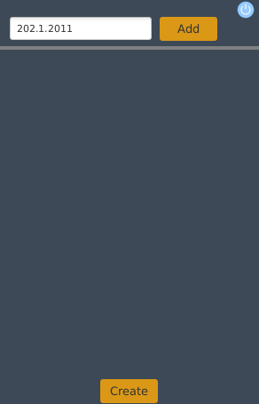
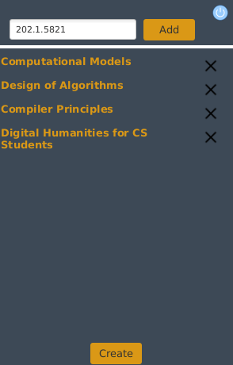

# Cariculus
A usefull tool to create a cariculum for students in BEN GURION UNIVERSITY. Cariculus will present to you all the possible options so you can filter them according to your needs. 
# Oreview
Add the courses to your couse list by typing the course number in the form xxx.x.xxx and press Add: 

  
After adding all the courses, 

  
 
 
  press the create button in order to see all the possible results: 
    
Now you can filter the results as you wish according to the filter menu to the right.
# Compile
1.Clone to project to your local computer. 
2.Open the main folder in terminal. 
3.Type maven javafx:run 
